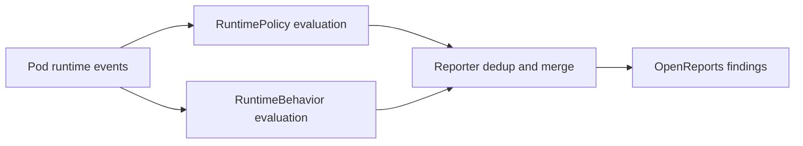
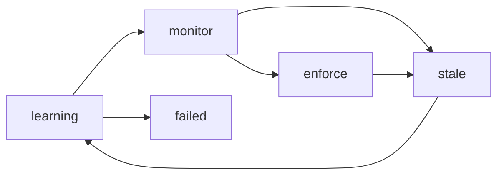

# Concepts

This document explains how Kyverno Runtime models runtime security using two
complementary resources: `RuntimePolicy` and `RuntimeBehavior`.

## Runtime Model

Kyverno Runtime is easiest to understand as two detection engines feeding one
reporting surface.



## Detection Engines

### RuntimePolicy (cluster-level signatures)

- Purpose: curated rules for known-bad runtime behavior.
- Scope: cluster-scoped CRD managed centrally by security/platform teams.
- Typical use: shell spawn detection, credential file access, public exfiltration.

### RuntimeBehavior (workload-level baseline)

- Purpose: learned known-good runtime profile per workload.
- Scope: per workload profile.
- Typical use: detect when one workload does something outside its normal behavior.

### Enrollment Model (monitor-first)

- The controller auto-creates `RuntimeBehavior` for enrolled workloads.
- New profiles start in `learning` or `monitor` mode.
- Teams promote to `enforce` only after confidence and lifecycle checks.
- Opt-out should be explicit and auditable.

## RuntimeBehavior Lifecycle



- `learning`: collect behavior, no enforcement.
- `monitor`: alert on deviations, tune profile.
- `enforce`: apply configured actions for deviations.
- `stale`: profile needs refresh (image or activity drift).
- `failed`: learning did not complete cleanly.

## Shared Defaults for Cluster-Wide "Good" Behavior

Use `RuntimeBehavior` resources without `workloadSelector` as reusable shared
libraries. Auto-created workload profiles can reference these shared defaults
through `spec.allow.refs`.

### Example: Shared defaults for all workloads

```yaml
apiVersion: runtime.kyverno.io/v1alpha1
kind: RuntimeBehavior
metadata:
  name: enterprise-safe-network
  namespace: kyverno-runtime
spec:
  allow:
    network:
      - dst: 10.0.0.0/8
      - dst: proxy.corp:3128
    dns:
      - "*.svc.cluster.local"
      - "*.corp.internal"
    open:
      - /etc/resolv.conf
      - /etc/ssl/certs/**
```

### Example: Runtime class defaults (Jupyter)

```yaml
apiVersion: runtime.kyverno.io/v1alpha1
kind: RuntimeBehavior
metadata:
  name: jupyter-approved-patterns
  namespace: kyverno-runtime
  labels:
    runtime.kyverno.io/runtime-class: jupyter
spec:
  allow:
    exec:
      - /usr/bin/python3
      - /usr/bin/python
      - /bin/bash
    open:
      - /usr/local/lib/python*/dist-packages/**
      - /home/**/*.ipynb
```

A pod labeled `runtime.kyverno.io/runtime-class: jupyter` can inherit this
shared behavior via auto-created `RuntimeBehavior` references.

## RuntimePolicy vs RuntimeBehavior

These resources are complementary and evaluate events in parallel.

| Scenario | RuntimePolicy | RuntimeBehavior | Result |
| --- | --- | --- | --- |
| Normal workload behavior | No signature match | In baseline | No alert |
| Known-bad pattern | Signature match | In or out of baseline | Critical/error signature finding |
| Unusual but not known-bad | No signature match | Out of baseline | Anomaly finding for review |
| Both match | Signature match | Out of baseline | Both findings in same report |

## Additional Reading

- [Configuration](configuration.md)
- [Design](../dev/DESIGN.md)
